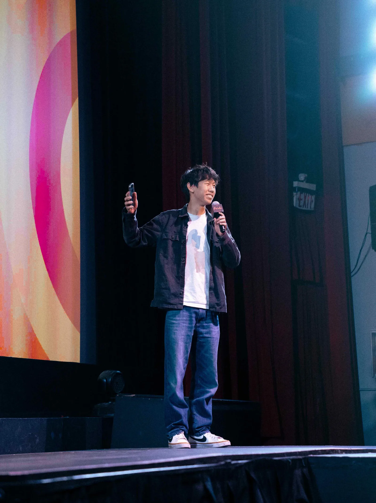
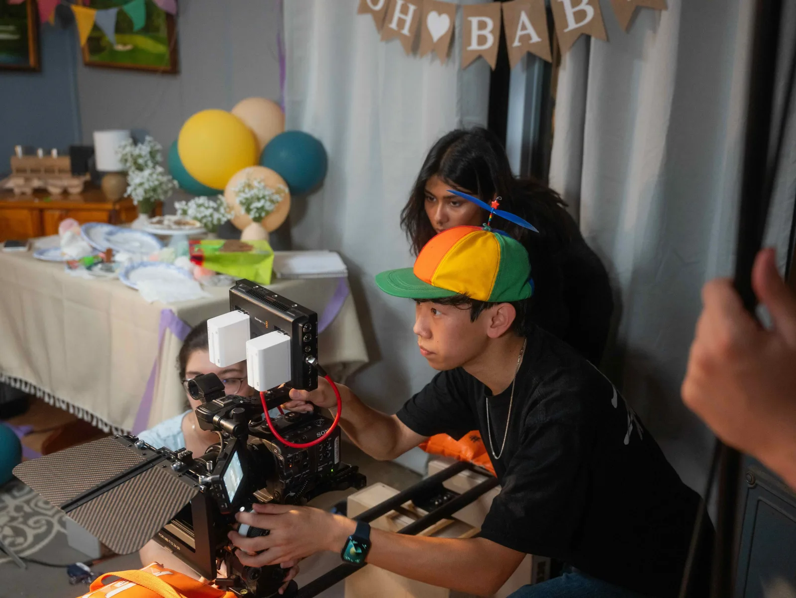

<td width="42%" valign="top"></td>

<td width="58%" valign="top"></td>

# Micah Lai

Hey! I'm a student at Cornell University studying Electrical & Computer
Engineering. I'm interested in CMOS sensor hardware and computational
engineering.

I also consider myself an artist, studying film & cinematography in high school and continue to do so as a hobby along with graphic design and photography.

In off hours: guitar, piano, dancing, and rock climbing.

→ **[micahlai.com](https://micahlai.com)**

[(Email)](mailto:mjl423@cornell.edu) · [(LinkedIn)](https://www.linkedin.com/in/micahlai/) · [(Instagram)](https://www.instagram.com/micahlai.ftv/) · [(Site)](https://micahlai.com)

1 Peter 4:10-11
